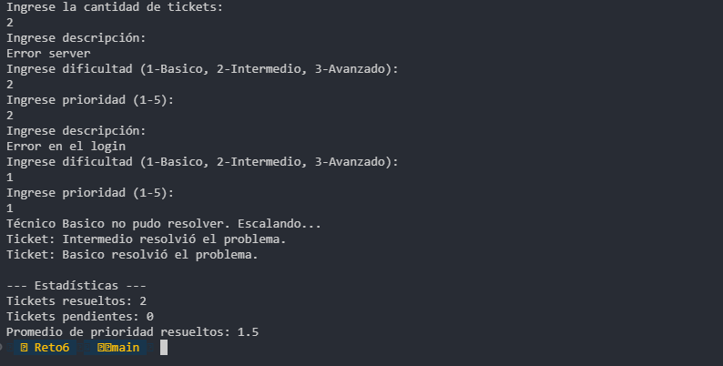

### Samuel Felipe Castelblanco Tellez
### Tomas Olaya Diaz

## Patrón de Diseño: Comportamiento.

## Patrón Utilizado: Chain of Responsibility.

* Justificación: El problema requiere que un ticket sea procesado por una cadena de técnicos con diferentes capacidades (básica, intermedia, avanzada) y especialidades. El ticket debe "viajar" por la jerarquía hasta encontrar al técnico adecuado, lo cual es la definición exacta de este patrón. Además, se cumple con el requerimiento de no acoplar la solicitud a un handler concreto.

### Cómo lo aplico:
Se define una interfaz o clase abstracta TecnicoHandler que contiene un enlace al "siguiente" técnico en la cadena.

* Cada nivel de soporte (Básico, Intermedio, Avanzado) implementa esta clase y decide si puede resolver el ticket basado en la dificultad, especialidad y prioridad.

* Si no puede, invoca al siguiente técnico (next.handle(ticket)).

## Ejemplo de ejecucion
